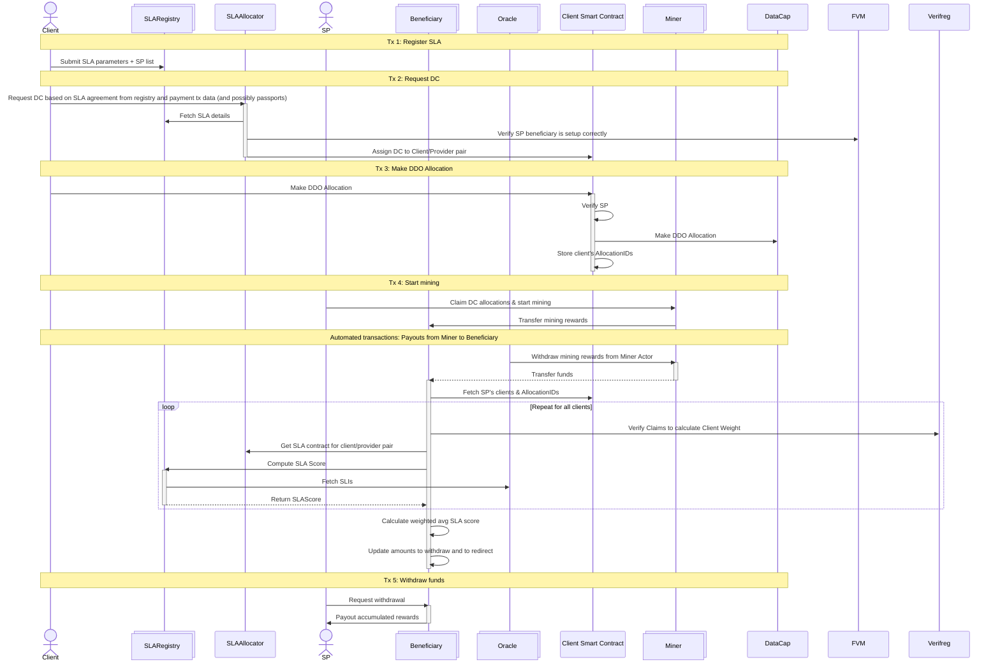
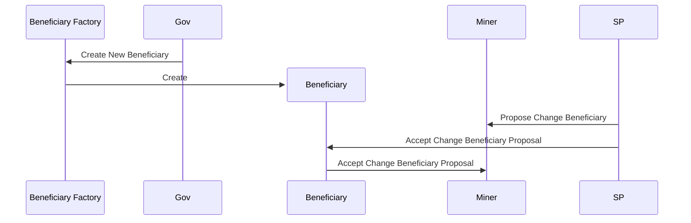

# SLA Allocator contracts

## Glossary
We expect following actors and contracts in the system:
1. **Client** - person that has data and wants to store it 
2. **SP** - person that runs a miner that can store data and mine blocks
3. **Miner** - instance of the [Miner Actor](https://github.com/filecoin-project/builtin-actors/tree/master/actors/miner)
4. **SLAAllocator** - singleton smart contract that grants DataCap (via **Client Smart Contract**) for **SPs** with correct beneficiary set
5. **Allocator Service** - off-chain service that provides attestations of Gitcoin Passport and deal payment
6. **Beneficiary** - smart contract (one per **Miner**) that manages payout of mining rewards to **SP**
7. **Client Smart Contract** - singleton smart contract that enforces restrictions on how DataCap can be spent by **Clients** and helps track metrics required by **Beneficiary** contract
8. **SLARegistry** - smart contract that tracks current SLA score for a **Client**/**Provider** pair. Any contract implementing the correct interface may be used - we will provide a reference one based on SLIs from CDP.
9. **Oracle** - smart contract that stores off-chain data regarding SLIs for providers. There may be many or none - **SLARegistry** contracts decide which oracles and how they want to use.
10. **Oracle Service** - off-chain service that submits transactions that update SLIs in the **Oracle**
11. **Beneficiary Factory** - singleton contract that deploys new instances of **Beneficiary** contract for storage providers, keeping a registry of those already deployed.
  
## SLAAllocator

**SLAAllocator** contract acts as a Verified Registry Verifier. It has a right to mint DataCap to clients.
In practice, all mint allowance will immediately be used to mint DataCap to the **Client Smart Contract**. DataCap will be assigned to actual **Clients** as an allowance on the **Client Smart Contract**.

It will assign DC to a client under following conditions:
1. **SLAAllocator** has enough mint allowance.
2. Sender, assumed to be the **Client**, has SLAs registered with all **SPs** that will be used in a compatible **SLARegistry** contract
3. **SP** has beneficiary set to an address contained in **Beneficiary Factory** registry, with effectively no quota (we require a very large quota to be set). Don't check expiration date.
4. For Passport-authenticated requests <= 1PiB:
    * score above 20 the client
    * one request per client per week
    * tx payment info is valid and matches size
    * tx payer is distinct from SP owner
5. For Passport-authenticated requests > 1PiB:
    * score above 20 for SP and client
    * distinct stamps between SP and client
    * one request per client per week
    * tx payment info is valid and matches size
    * tx payer is distinct from SP owner
5. For non-Passport-authenticated requests:
    * 5 requests per day GLOBALLY
    * <= 100TiB
    * tx payment info is valid and matches size
    * tx payer is distinct from SP owner

There will be following roles in this contract:
* `ADMIN`, who can manage other roles and upgrade the contract
* `MANAGER`, who can call `mintDataCap(uint256 amount)`.
* `ATTESTATOR`, who can sign attestations of passport scores, stamps and transaction info

// FIXME we must check past SLAs of the provider

Expected interface:
```
interface SLAAllocator {
    struct Signature {
        uint8 v;
        bytes32 r;
        bytes32 s;
    }

    struct Passport {
        address subject;
        uint256 expiration_timestamp;
        uint64 score;
    };

    struct PassportSigned {
        Passport passport;
        Signature sig;
    }

    struct ManualAttestation {
        bytes32 attestation_id;
        address client;
        FilActorId provider;
        uint256 amount;
        string opaque_data;
    }

    struct ManualAttestationSigned {
        ManualAttestation attestation;
        Signature sig;
    };

    struct PaymentTransaction {
        bytes id;
        FilAddress from;
        FilAddress to;
        uint256 amount;
    }

    struct PaymentTransactionSigned {
        PaymentTransaction tx;
        Signature sig;
    }

    function initialize(address admin, address manager, address beneficiaryRegistry, address clientSmartContract, address attestator) external;

    // use Verifreg powers to mint datacap to a client smart contract
    function mintDataCap(uint256 amount) external onlyRole(MANAGER_ROLE);
    
    // request datacap based on SLAs
    function requestDataCap(FilActorId provider, address slaContract, uint256 amount, PaymentTransactionSigned tx) external;

    // request datacap based on SLAs and client's passport
    function requestDataCap(FilActorId provider, address slaContract, uint256 amount, PassportSigned clientPassport, PaymentTransactionSigned tx) external;

    // request datacap based on SLAs, client's passport and SP's passport
    function requestDataCap(FilActorId provider, address slaContract, uint256 amount, PassportSigned clientPassport, PassportSigned spPassport) external;

    // request datacap based on SLAs and manual attestation
    function requestDataCap(FilActorId provider, address slaContract, uint256 amount, ManualAttestationSigned attestation) external;
    
    // administrative
    function setBeneficiaryRegistry(address newBeneficiaryRegistry) external onlyRole(ADMIN_ROLE);
    function setClientSmartContract(address newClientSmartContract) external onlyRole(ADMIN_ROLE);
    // and functions inherited from OpenZeppelin's AccessControl and UUPSUpgradeable
}
```

Expected storage items:
```
address beneficiaryRegistry;
address clientSmartContract;
mapping(bytes32 id => bool isUsed) usedManualAttestations;
mapping(bytes id => bool isUsed) usedTransactions;
mapping(address client => mapping(address provider => address contract)) slaContracts;
// FIXME rate limiting storage items
// and items inherited from OpenZeppelin's AccessControl and UUPSUpgradeable
```

## Client Smart Contract

**Client Smart Contract** acts as a Verified Registry Client. It has a DataCap and may transfer it to Verifreg to create Allocations.

The main function it will implement is `transfer`, which copies the interface of DataCap and expects a transfer of DC to Verifreg with Verifreg-compatible operator data. See [FIDL Client Smart Contract](https://github.com/fidlabs/contract-metaallocator/blob/main/src/Client.sol#L71) for reference. It will transfer the DataCap and create allocations under following conditions:
1. **Client Smart Contract** has enough DataCap
2. **Client** has enough allowance left to spend with given **SP**
3. **SP** has correct configuration of beneficiary (address from registry, unlimited quota, expiration set to at least longest deal + 180 days)
It will also track how much given **Client** spent with given **SP** so that **Beneficiary** can reference it when calculating weights for payout.

There will be following roles in this contract:
* `ADMIN`, who can manage other roles and upgrade the contract
* `ALLOCATOR`, who can manage allowances

Expected interface:
```
interface Client {
    function initialize(address admin, address slaAllocator, address beneficiaryRegistry) external;
    function transfer(DataCapTypes.TransferParams calldata params) external;
    function increaseAllowance(address client, FilActorId provider, uint256 amount) external onlyRole(ALLOCATOR_ROLE);
    function decreaseAllowance(address client, FilActorId provider, uint256 amount) external onlyRole(ALLOCATOR_ROLE);
    // administrative
    function setBeneficiaryRegistry(address newBeneficiaryRegistry) external onlyRole(ADMIN_ROLE);
    // and functions inherited from OpenZeppelin's AccessControl, UUPSUpgradeable and Multicall
}
```

Expected storage items:
```
struct SPClient {
    address client;
    uint256 amountSpent;
}

address beneficiaryRegistry;
address slaAllocatorContract;
mapping(address client => mapping(address provider => uint256 amount)) allowances;
mapping(address provider => SPClient[] client) spClients;
// and items inherited from OpenZeppelin's AccessControl, UUPSUpgradeable and Multicall
```

## Beneficiary

**Beneficiary** contract acts as the beneficiary for **Miner** - it receives mining rewards. It will enforce SLA rules by reducing the amount of rewards being paid out to **SP** in case SLAs are breached.

The main function implemented by the contract is `withdraw`. It allows withdrawing collected mining rewards based on the SLA. The SLA is calculated by:
1. Fetching list of **Clients** and how much they spent with **SP** from **Client Smart Contract**
2. Fetching **SLARegistry** address for each **Client** from **SLAAllocator**
3. Fetching SLA Score of each **Client** from **SLARegistries**
4. Calculating weighted average of scores based on how much each client spent with **SP**

There will be following roles in this contract:
* `ADMIN`, who can manage addresses and other roles
* `WITHDRAWER_ROLE`, who can withdraw rewards (subject to SLA)
* `TERMINATION_ORACLE`, who can notify contract about early terminations of claims

Expected interface:
```
interface Beneficiary {
    function initialize(address admin, address provider, address clientSmartContract, address slaAllocator, address burnAddress) external;
    function withdraw(FilAddress recipient) external onlyRole(WITHDRAWER_ROLE);
    
    receive();

    function acceptBeneficiary(CommonTypes.FilActorId minerId) external;
    function changeBeneficiary(CommonTypes.FilActorId minerId, CommonTypes.FilAddresses newBeneficiary, uint256 newQuota, int64 newExpirationChainEpoch) external onlyRole(ADMIN_ROLE);

    function claimsTerminatedEarly(uint64[] claims) external onlyRole(TERMINATION_ORACLE);

    // administrative
    function setClientSmartContract(address new) external onlyRole(ADMIN_ROLE);
    function setSLAAllocator(address new) external onlyRole(ADMIN_ROLE);
    function setBurnAddress(address new) external onlyRole(ADMIN_ROLE);
    // and functions inherited from OpenZeppelin's AccessControl
}
```

Expected storage items:
```
address clientSmartContract;
address slaAllocatorContract;
address burnAddress;
// and items inherited from OpenZeppelin's AccessControl, UUPSUpgradeable and Multicall
```

**Beneficiary** will use [Beacon Proxy pattern](https://docs.openzeppelin.com/contracts-stylus/beacon-proxy) for upgradeability.

## SLARegistry

**SLARegistry** contains a registry of SLA's between **Clients** and **SPs** and implements a logic for evaluating them. Any **SLARegistry** implementing a *SLARegistryInterface* may be used.

```
interface SLARegistryInterface {
    // must revert if there's no agreement registered for given client/provider pair
    function score(address client, address provider) external;
}
```

**FIDLSLARegistry** will be a reference **SLARegistry** provided by FIDL. It will be upgradeable and will implement the following interface:
```
interface FIDLSLARegistry is SLARegistryInterface {
    function initialize(address admin, address oracle) external;

    // callable by the client or miner owner
    function registerSLA(address client, address provider, SLAParams slaParams) external;
}
```

## Oracle

**Oracle** is a contract that provides information about off-chain world. Details of logic and interface is between **Oracle** and **SLARegistry** - there are no requirements from SLA Allocator system.

**FIDLOracle** is a reference **Oracle** provided by FIDL that uses data from DataCapStats for SLIs. It will be upgradeable and implement a following interface:

```
interface FIDLOracle {
    struct SLIAttestation {
        uint256 lastUpdate;
        uint16 availability;
        uint16 latency;
        uint16 indexing;
        uint16 retention;
        uint16 bandwidth;
        uint16 stability;
    }
    function setSLI(address provider, SLIAttestation calldata slis) external onlyRole(ORACLE_ROLE);
}
```

Expected storage items:
```
mapping(address provider => SLIAttestation attestation) public attestations;
```

## Diagrams

A typical full flow from registering SLA to withdrawing mining rewards will look as follows:


Onboarding a new **SP** will require deploying a new instance of **Beneficiary**. **Beneficiary** must accept becoming a beneficiary for a miner. The proposed flow for MVP is as follows:



## Unaddressed issues

1. We should check past SLAs of an SP when granting DC in SLAAllocator
